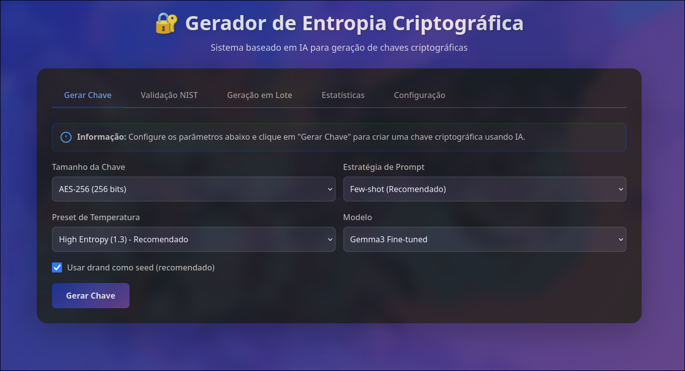

# PoC : Avaliação do Uso de Inteligência Artificial na Geração de Entropia para Chaves Criptográficas

## Objetivo

Prova de Conceito (PoC) para geração e validação de chaves criptográficas, integrando uma LLM (via API) e fonte pública de entropia (League of Entropy/drand). 

## Funcionalidades

- Consome entropia diretamente da API drand.
- Gera chaves usando uma LLM baseada em seed público.
- Aplica pós-processamento e validação estatística (entropia/NIST).
- Expõe serviço REST via Flask.


## Instalação

Primeiro é necessário clonar o repositório em sua máquina:

```bash
git clone https://github.com/Brenda-Machado/llm-entropy-criptography.git
cd llm-entropy-criptography
```

### Requisitos

Criar o ambiente virtual e instalar os requisitos:

```bash
make venv
make install
```

Além dos requirements, é necessário fazer o setup do Ollama server, consulte as instruções em [SETUP_OLLAMA.md](SETUP_OLLAMA.md).

## Uso

Uma vez que o Ollama server e os requisitos estão instalados, para rodar a aplicação principal execute:

```bash
make run
```

Após isso, abra o navegador em `http://localhost:5000` para acessar a interface da aplicação.



## Arquivos importantes

- `app.py`: API Flask e orquestração
- `drand_client.py`: integração League of Entropy
- `llm_client.py`: integração LLM
- `nist_tests.py`: testes NIST SP 800-22
- `vector_store.py`: armazenamento de exemplos
- `test_nist_integration.py`: integração LLM com NIST

## Endpoints da API

Para interagir com a API via terminal, segue os endpoints:

### Gerar chave
```bash
curl -X POST http://localhost:5000/generate_key \
  -H "Content-Type: application/json" \
  -d '{"key_size": 256, "strategy": "few-shot"}'
```

### Validar com NIST
```bash
curl -X POST http://localhost:5000/nist/validate_key \
  -H "Content-Type: application/json" \
  -d '{"key_hex": "a3f5b82c9e1d47f6b0e8c2a7d4f1e9b3c6a8f2d5e7b1c4a9f3e6d2b5c8a1f4e7"}'
```

### Gerar e validar
```bash
curl -X POST http://localhost:5000/nist/generate_and_validate \
  -H "Content-Type: application/json" \
  -d '{"key_size": 256, "strategy": "few-shot"}'
```

### Configuração
Variáveis de ambiente disponíveis (opcional):

```bash
export KEY_SIZE_BITS=256
export PROMPT_STRATEGY=few-shot
export TEMPERATURE_PRESET=high_entropy
export OLLAMA_MODEL=gemma3:latest
export OLLAMA_BASE_URL=http://localhost:11434
```

> [!IMPORTANT]
> Essa implementação foi parcialmente feita com o uso da IA Claude, como objetivo da disciplina de Tópicos Especiais em Aplicações Tecnológicas I (INE5448) 2025/2. 


## Referências
- NIST SP 800-22: A Statistical Test Suite for Random and Pseudorandom Number Generators
- League of Entropy (drand): https://drand.love
- Ollama: https://ollama.ai

## Licença

MIT

***
